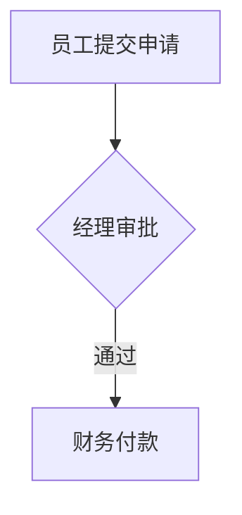
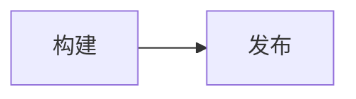

# 团队流程

维护人：示例团队。审批和发布分别记录，互不替代。

## 审批流程

```mermaid
flowchart TD
    A["员工提交申请"] --> B{"经理审批"}
    B -->|通过| C["财务付款"]
```

审批备注：只维护已确认的规则。

## 发布流程

```mermaid
flowchart LR
    Build["构建"] --> Release["发布"]
```

请保留[文档内导航](#发布流程)。
